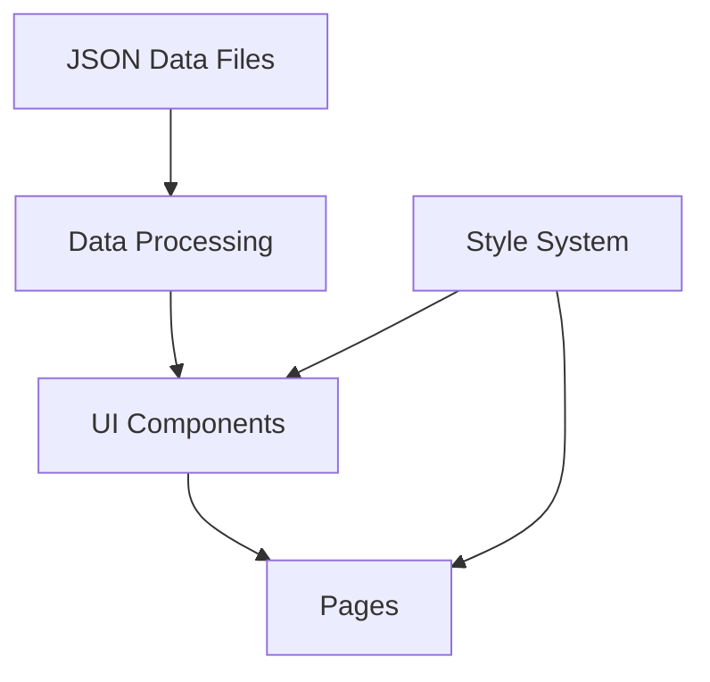
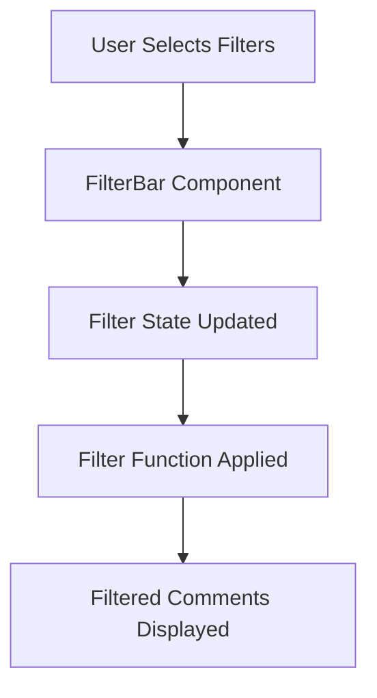
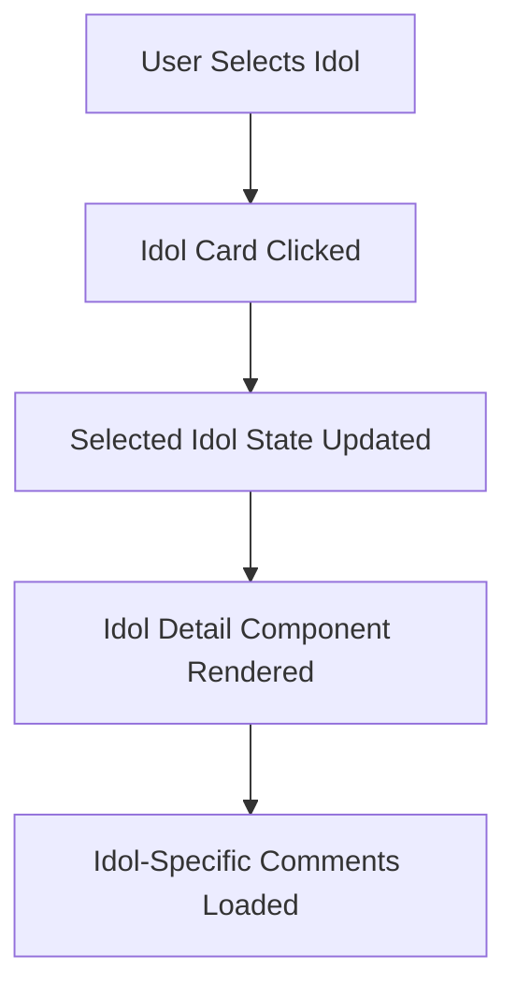
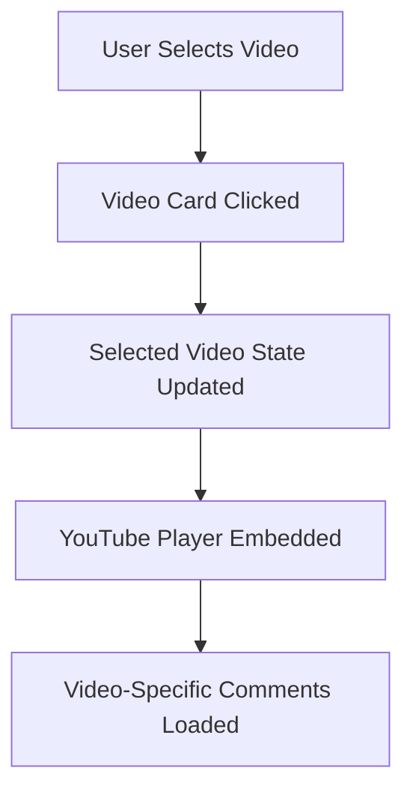

# System Patterns

## Architecture Overview

The application follows a component-based architecture using SvelteKit, with a clear separation of concerns between data, UI components, and pages.

## Key Components

### Data Layer
- **JSON Data Files**: Located in `src/lib/data/`, these files contain the structured data for comments, findings, idols, and videos.
- **Data Processing Utilities**: Located in `src/lib/utils/`, these utilities handle data transformation, filtering, and analysis.

### UI Components
- **CommentCard**: Displays a single comment with sentiment, tags, and metadata.
- **IdolProfile**: Displays information about a K-pop idol, including their accent type and background.
- **SentimentChart**: Visualizes sentiment distribution using a pie chart.
- **AccentBadge**: Displays a badge indicating an accent type.
- **FilterBar**: Provides filtering options for comments.
- **VideoPlayer**: Embeds YouTube videos with additional metadata.

### Pages
- **Home**: Landing page with research overview and navigation.
- **Comments**: Explorer for browsing and filtering comments.
- **Idols**: Profiles of K-pop idols featured in the research.
- **Videos**: YouTube videos analyzed in the research.
- **Learn**: Educational content about linguistic concepts.
- **About**: Information about the project and research.

### Style System
- **CSS Variables**: Defined in `src/app.css`, these variables provide a consistent design system.
- **Responsive Design**: Media queries ensure the application works on all device sizes.

## Data Flow Patterns

### Comment Filtering Flow

### Idol Selection Flow

### Video Playback Flow

## Component Patterns

### Card Pattern
Used for displaying discrete pieces of information:
- Comment cards
- Idol profile cards
- Video cards
- Feature cards

### Filter Pattern
Used for filtering data based on user selection:
- Sentiment filters
- Aspect filters
- Idol filters
- Language filters

### Chart Pattern
Used for visualizing data:
- Sentiment distribution chart
- (Planned) Aspect distribution chart

### Badge Pattern
Used for indicating categories or types:
- Accent type badges
- Sentiment indicators
- Tag badges

## State Management

The application uses Svelte's built-in reactivity system for state management:

- **Local Component State**: Used for component-specific state (e.g., isExpanded, isLoading).
- **Page-Level State**: Used for page-specific state (e.g., selectedFilters, currentPage).
- **Derived State**: Used for computed values based on other state (e.g., filteredComments, paginatedComments).

## Responsive Design Patterns

The application uses a mobile-first approach with breakpoints at:
- **Mobile**: 0-639px
- **Tablet**: 640px-1023px
- **Desktop**: 1024px+

Key responsive patterns include:
- Single column layouts on mobile, multi-column on larger screens
- Stacked components on mobile, side-by-side on larger screens
- Adjusted font sizes and spacing for different screen sizes

## Accessibility Patterns

The application aims to follow accessibility best practices, but currently has some issues to address:
- Need to add keyboard event handlers to clickable elements
- Need to add proper ARIA roles to interactive elements
- Ensure sufficient color contrast for all text
- Provide alternative text for images and icons

## Future Architectural Considerations

1. **Enhanced Data Processing**: Improve the data processing utilities to handle more complex filtering and analysis.
2. **Additional Visualizations**: Add more chart components for visualizing different aspects of the data.
3. **Improved Accessibility**: Address the current accessibility issues and implement more robust accessibility patterns.
4. **Performance Optimization**: Optimize data loading and processing for better performance with larger datasets.
5. **Internationalization**: Consider adding support for multiple languages, particularly Korean.
